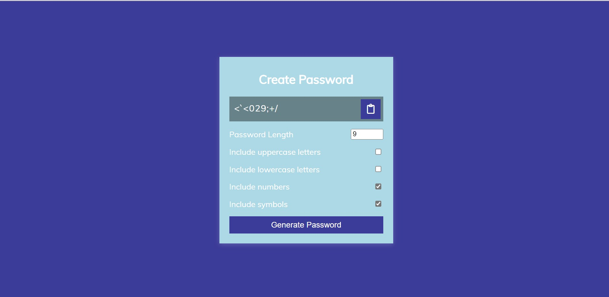
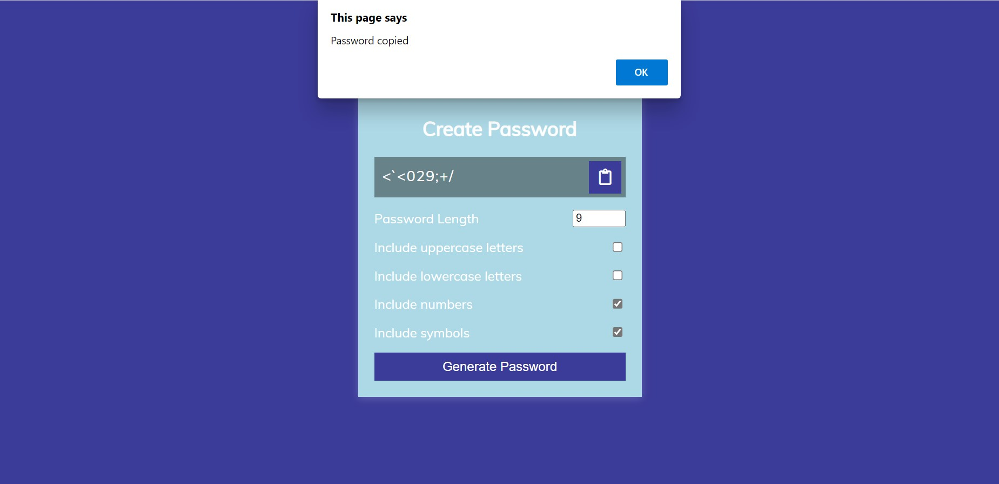

# Password Generator

The Password generator  generates a random password that  consist of alphabets, numbers, and special characters.

It takes input from user to include 

* lowercase alphabets
* uppercase alphabets
* numbers, and 
* special characters
* length (4-20)

It then generates the random password.

The generated password can be copied to clipboard as well.

**Live link**

[Password Generator](https://password-generator-js-project1.netlify.app/)

**Technology  Used**

1.HTML

2.CSS

3.Javascript

**Previews**

